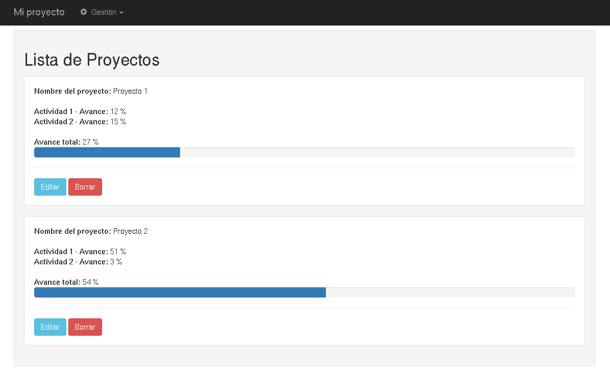

# Sistema que permite generar un gráfico de barra de progreso porcentual a partir de un valor.

Autor: Ing. Argenis Osorio

## Versiones
```
Django==1.8.8
Python==2.7
```

<b>Nota:</b>
<br />
Usaremos $ para describir los comandos que se usaran con usuario regular.

Usaremos # para describir los comandos que se usaran con superusuario. 

## Comando usado para probar el proyecto

$ bash reset_db.sh

## Captura
